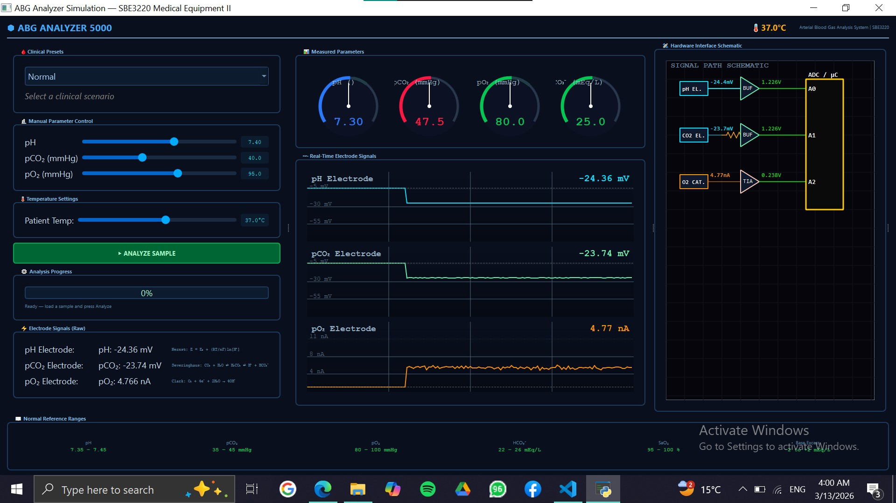
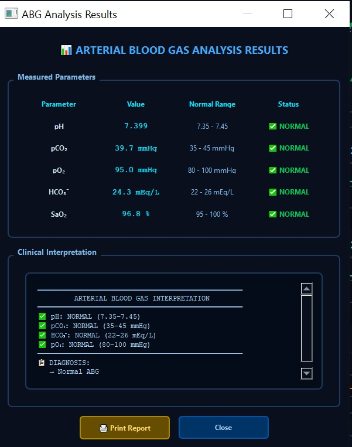

# ABG Analyzer Simulation

A comprehensive educational simulation of an Arterial Blood Gas (ABG) analyzer, demonstrating the physics and electronics behind blood gas measurements.


*Figure 1: Main application window with waveform displays and controls*


*Figure 2: Results popup window showing measured parameters and clinical interpretation*

## 📋 Overview

This simulation provides a realistic model of an ABG analyzer used in clinical settings to measure arterial blood gases. It demonstrates:

- **Electrode Physics**: Nernst equation for pH, Severinghaus principle for pCO₂, and Clark electrode for pO₂
- **Signal Processing**: Raw electrode signals, amplification, and conditioning
- **Clinical Calculations**: Henderson-Hasselbalch equation for HCO₃⁻, oxygen-haemoglobin dissociation curve for SaO₂
- **Real-time Waveforms**: Live display of electrode signals with noise and drift
- **Clinical Interpretation**: Rule-based diagnosis of acid-base disorders

## 🚀 Features

### Clinical Presets
- Normal
- Respiratory Acidosis
- Respiratory Alkalosis
- Metabolic Acidosis
- Metabolic Alkalosis
- Mixed Respiratory + Metabolic Acidosis
- ARDS / Hypoxemia

### Real-time Monitoring
- Live waveform displays for all three electrodes
- Analog gauge displays for pH, pCO₂, pO₂, and HCO₃⁻
- Circuit schematic showing signal path
- Raw electrode signal values

### Analysis Capabilities
- Temperature compensation (32°C - 41°C)
- Automatic HCO₃⁻ calculation
- SaO₂ calculation from pO₂
- Clinical interpretation with diagnosis
- Popup results window with detailed analysis

### Educational Elements
- Display of underlying physical principles for each electrode
- Realistic noise and signal characteristics
- Electrode drift simulation
- Temperature effects on measurements

## 🔧 Technical Details

### Electrode Models

#### pH Electrode (Nernst Equation)
```
E = E₀ + (RT/nF)ln[H⁺]
```
- Glass membrane electrode
- Temperature-dependent slope
- Asymmetry potential simulation
- Range: 6.8 - 7.8 pH units

#### pCO₂ Electrode (Severinghaus Principle)
```
CO₂ + H₂O ⇌ H₂CO₃ ⇌ H⁺ + HCO₃⁻
```
- Modified pH electrode with CO₂-permeable membrane
- Inner bicarbonate solution
- Temperature-dependent solubility
- Range: 15 - 80 mmHg

#### pO₂ Electrode (Clark Electrode)
```
O₂ + 4e⁻ + 2H₂O → 4OH⁻
```
- Polarographic oxygen sensor
- Platinum cathode, silver anode
- Oxygen consumption simulation
- Flow-dependent response
- Range: 20 - 140 mmHg

### Derived Parameters

**HCO₃⁻ (Bicarbonate)**
```
[HCO₃⁻] = 0.0307 × pCO₂ × 10^(pH - 6.1)
```

**SaO₂ (Oxygen Saturation)**
```
SaO₂ = 100 × (pO₂^n) / (pO₂^n + P50^n)
where n = 2.7, P50 = 26.8 mmHg
```

## 🎯 Clinical Interpretation Logic

The system analyzes the results using standard clinical criteria:

| Parameter | Normal Range | Interpretation |
|-----------|--------------|----------------|
| pH | 7.35 - 7.45 | < 7.35: Acidosis<br>> 7.45: Alkalosis |
| pCO₂ | 35 - 45 mmHg | < 35: Respiratory Alkalosis<br>> 45: Respiratory Acidosis |
| pO₂ | 80 - 100 mmHg | < 60: Severe Hypoxemia<br>60-80: Mild Hypoxemia |
| HCO₃⁻ | 22 - 26 mEq/L | < 22: Metabolic Acidosis<br>> 26: Metabolic Alkalosis |
| SaO₂ | 95 - 100% | < 95: Hypoxemia |

### Diagnosis Rules
- **Acute Respiratory Acidosis**: pH ↓, pCO₂ ↑, HCO₃⁻ normal
- **Chronic Respiratory Acidosis**: pH ↓, pCO₂ ↑, HCO₃⁻ ↑
- **Acute Respiratory Alkalosis**: pH ↑, pCO₂ ↓, HCO₃⁻ normal
- **Metabolic Acidosis**: pH ↓, HCO₃⁻ ↓, pCO₂ normal/↓
- **Metabolic Alkalosis**: pH ↑, HCO₃⁻ ↑, pCO₂ normal/↑
- **Mixed Disorders**: Combined respiratory and metabolic components

## 🖥️ User Interface

### Main Window Sections

1. **Left Panel**
   - Clinical Presets dropdown
   - Manual parameter sliders
   - Temperature control
   - Analyze button
   - Progress bar
   - Raw electrode signals

2. **Center Panel**
   - Analog gauges for all parameters
   - Real-time waveform displays
   - Circuit schematic visualization

3. **Right Panel**
   - Results popup information
   - Normal reference ranges

### Results Popup Window
- Clean, organized display of all measured parameters
- Color-coded status indicators
- Full clinical interpretation with diagnosis
- Maximizable window for better viewing
- Print report option (simulated)

## 📦 Installation

### Prerequisites
- Python 3.6 or higher
- PyQt5

### Setup

1. Clone or download the repository
```bash
git clone https://github.com/yourusername/abg-analyzer.git
cd abg-analyzer
```

2. Install required packages:
```bash
pip install PyQt5
```

3. Run the application:
```bash
python abg_analyzer.py
```

## 🎮 How to Use

1. **Select a Preset**: Choose a clinical scenario from the dropdown menu
2. **Adjust Parameters**: Fine-tune values using the sliders if needed
3. **Set Temperature**: Adjust patient temperature if different from 37°C
4. **Analyze**: Click "ANALYZE SAMPLE" to run the analysis
5. **View Results**: The progress bar will show analysis steps, then a popup window will appear with detailed results (see Figure 2)
6. **Interpret**: Review the clinical interpretation and diagnosis
7. **Print/Save**: Use the print button to simulate report generation

## 📸 Screenshots

To include screenshots in this README:

1. **Take a screenshot of the main window** and save it as `screenshot.png` in the same directory as this README
2. **Take a screenshot of the results popup** and save it as `results.png` in the same directory

The screenshots will automatically appear in the document as shown in Figures 1 and 2 above.

## 🧪 Educational Use

This simulation is designed for medical equipment courses to demonstrate:

- **Physical Principles**: How different electrodes measure blood parameters
- **Signal Processing**: From raw electrode signals to conditioned outputs
- **Clinical Chemistry**: Henderson-Hasselbalch equation and oxygen dissociation
- **Acid-Base Balance**: Understanding respiratory vs metabolic disorders
- **Medical Device Design**: Circuit schematics and signal flow

## ⚙️ Configuration

You can modify the simulation parameters in the code:

- `PRESETS`: Dictionary of clinical scenarios
- `NORMAL`: Normal reference ranges
- Electrode parameters in `ElectrodeModels` class
- Waveform update rates
- Noise levels and drift characteristics

## 🔬 Technical Specifications

### Electrode Ranges
| Parameter | Range | Resolution |
|-----------|-------|------------|
| pH | 6.80 - 7.80 | 0.01 |
| pCO₂ | 15 - 80 mmHg | 0.1 mmHg |
| pO₂ | 20 - 140 mmHg | 0.1 mmHg |
| HCO₃⁻ | 10 - 40 mEq/L | 0.1 mEq/L |
| SaO₂ | 0 - 100% | 0.1% |

### Update Rates
- Waveform display: 20 fps
- Analysis simulation: 100ms steps
- Temperature response: Immediate

## 📝 Notes

- The simulation includes realistic noise and electrode drift for educational purposes
- Results are calculated based on physiological models, not actual patient data
- The print function is simulated and does not actually print
- All measurements are simulated and should not be used for clinical decisions

## 🐛 Troubleshooting

**No waveform display?**
- Check that the waveform timer is running
- Ensure the window is not minimized

**Results not appearing?**
- Wait for analysis to complete (progress bar reaches 100%)
- Check that no modal dialogs are blocking the popup

**Sliders not responding?**
- Values are normalized to physiological ranges
- Try resetting with a preset

## 📊 Sample Results

When you run an analysis on a normal sample, you should see results similar to:

```
pH: 7.40 (NORMAL)
pCO₂: 40.0 mmHg (NORMAL)
pO₂: 95.0 mmHg (NORMAL)
HCO₃⁻: 24.0 mEq/L (NORMAL)
SaO₂: 97.5% (NORMAL)

Diagnosis: Normal ABG
```


## 📚 References

1. Severinghaus, J.W. & Bradley, A.F. (1958). Electrodes for blood pO₂ and pCO₂ determination
2. Henderson-Hasselbalch equation for acid-base balance
3. Clark, L.C. (1956). Monitor and control of blood oxygen tension
4. Clinical guidelines for ABG interpretation (ATS/ERS)

